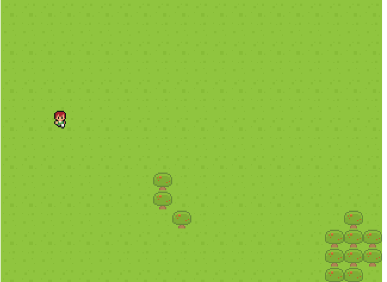
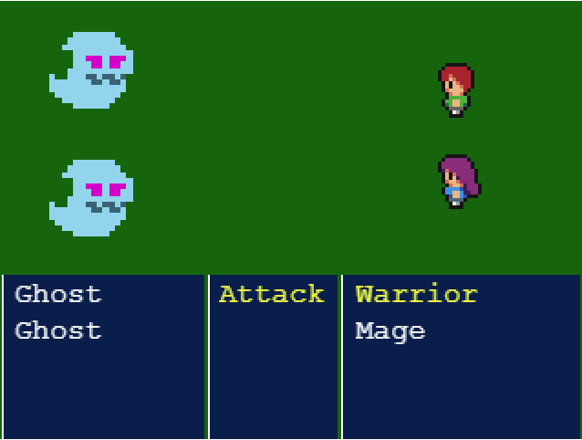
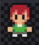

# Mounsters Hunter

> This is an RPG medieval game where the user is capable to move around the map and find a mounster randomly. The user will have 2 turns using a warrior and a wizard, and the user will have to fight until the mounsters or the Heroes die.

## :red_circle: Live Demo:

[Live Demo Link](https://monsters-hunter.netlify.app/)

## :hammer: Built with

- HTML5
- JavaScript
- Webpack
- Linters
- VS code
- Phaser 3

## Game Functionality

### Concept

- Control to the warrior to find monsters around the map.
- Kill as many monsters as possible.
- Avoid being killed by the 4 different monsters that exist in the world.

### Controls

You need a keyboard to control the Player Ship.

- Press ⬆️ to move up.
- Press :arrow_down: to move down.
- Press ➡️ to go right.
- Press ⬅️ to go left.

When finding a monster.

- Press ⬆️ or :arrow_down: to select the monster you want to attack.
- Press <kbd>Space</kbd> to attack the monster.

### Assets

| Asset                                                                                                                                                                                     | Description      |
| ----------------------------------------------------------------------------------------------------------------------------------------------------------------------------------------- | ---------------- |
|                                                                                             | Heroes           |
|    | Enemies to kill. |

## :construction_worker: Getting Started

To get a local copy up and running follow these simple steps:

1. Go to the [repository page](https://github.com/kcotrinam/RPG_game_capstone).
2. Press the "Code" button and copy the link.
3. Clone it using git command `git clone <link>`.

## :construction_worker: How to use?

1. Move to the folder: `cd RPG_game_capstone`.
2. run `npm install`.
3. on your command line run: `npm run dev` (development) or `npm run build` (Production).
4. start server:
   4.1 [live server](https://marketplace.visualstudio.com/items?itemName=ritwickdey.LiveServer) can be used to visualize the webapp in live version or
   4.2 execute on the command line `servor dist index.html 8080 --reload` and enter to your browser to `localhost:8080`.

## :construction_worker: How to run tests?

1. Move to the folder: `cd RPG_game_capstone`.
2. Run `npm run test`.

## :bust_in_silhouette: Author

👤 **Kevin Cotrina**

- GitHub: [kcotrinam](https://github.com/kcotrinam)
- Twitter: [@kcotrinam_dev](https://twitter.com/kcotrinam_dev)
- LinkedIn: [KevinCotrina](https://www.linkedin.com/in/kevincotrina/)

## 🤝 :raised_hand: :raised_hand: Contributions

Contributions, issues, and feature requests are welcome!

Feel free to check the [issues page](https://github.com/kcotrinam/RPG_game_capstone/issues).

## :muscle: Show your support

Give a ⭐️ if you like this project!

## :grey_exclamation: Acknowledgment

- [Microverse](https://www.microverse.org/)
- [Zenva Pty Ltd](https://gamedevacademy.org/how-to-create-a-turn-based-rpg-game-in-phaser-3-part-1/)
- Stand up team

## 📝 License

This project is [MIT](LICENSE) licensed.
